# Aflamak

    Aflamak is a web application, designed to offer a rich streaming experience for films, TV shows, and episodes. Built using C#, SQL Server, and .NET, it includes a variety of features to enhance user engagement and           satisfaction.

# Features

    Homepage Highlights: Displays the latest and top-rated films, TV shows, and episodes, with a special focus on Arabic content and Ramadan TV shows.
    Advanced Filtering: Filter content by year, language, category, and type.
    Comprehensive Search: Search for actors, producers, films, and TV shows in both Arabic and English.
    Detailed Content Views: View cast and crew details, related films, and like/dislike counts for each film and TV show.
    TV Show Breakdown: Explore TV shows by parts and episodes.
    Admin Management: Manage actors, producers, films, tvshows, roles and users with ease.

# Technologies Used

    C#
    SQL Server
    .NET
    ASP.Net Core MVC   
    
# Usage

    Visit the homepage to browse the latest and top-rated content.
    
    Use the filter options to narrow down your search.
    
    Search for specific actors, producers, films, or TV shows.
    
    Admins can log in to manage roles and users.

# Some Photos of the App

    

    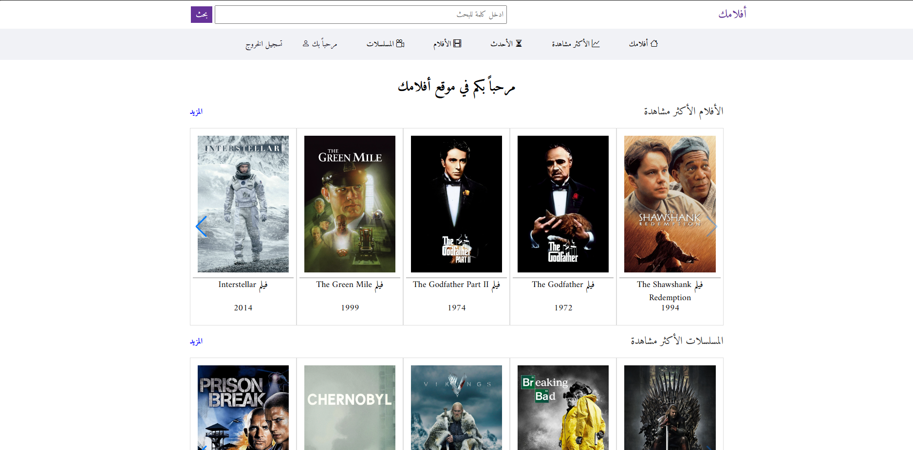
    
    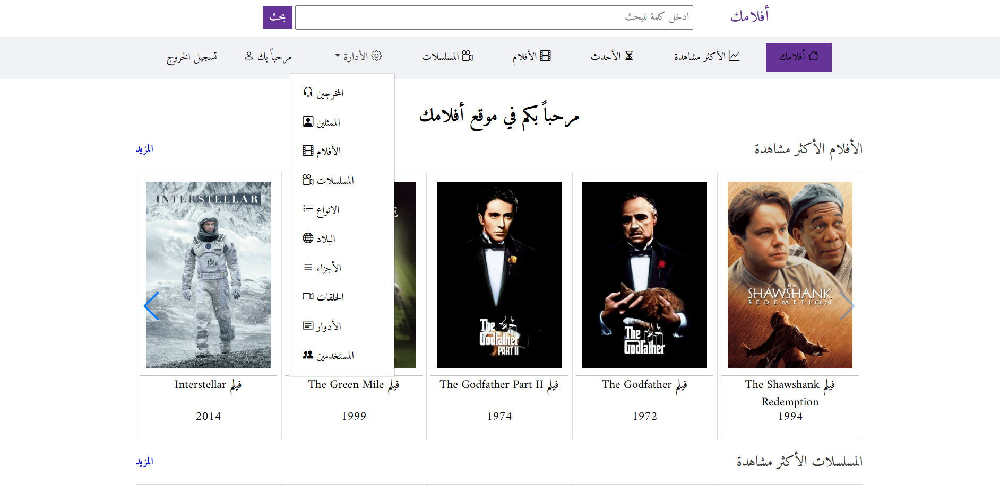
    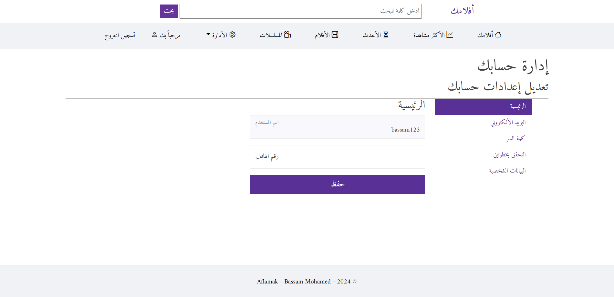
    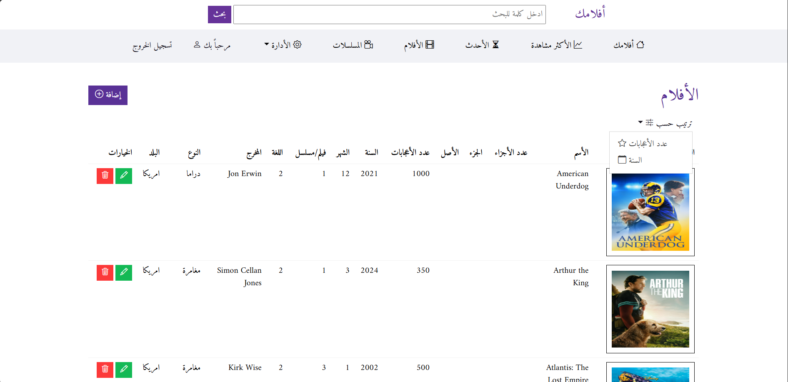
    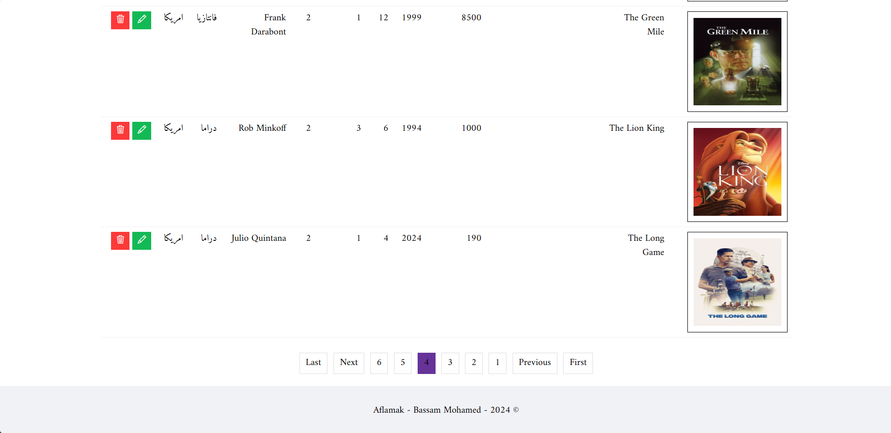
    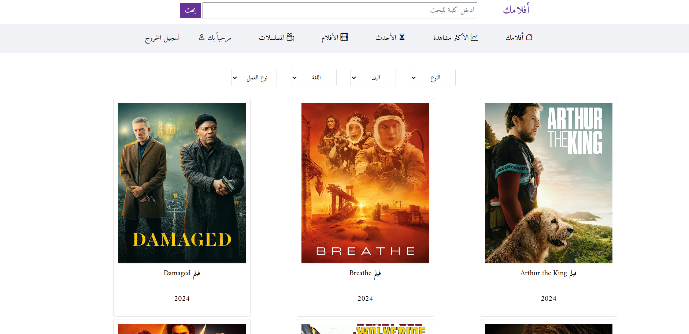
    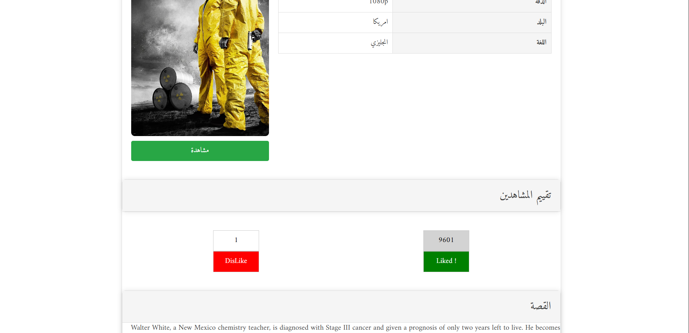
    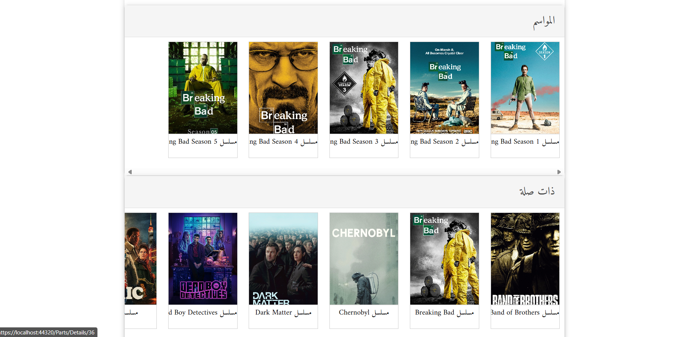
    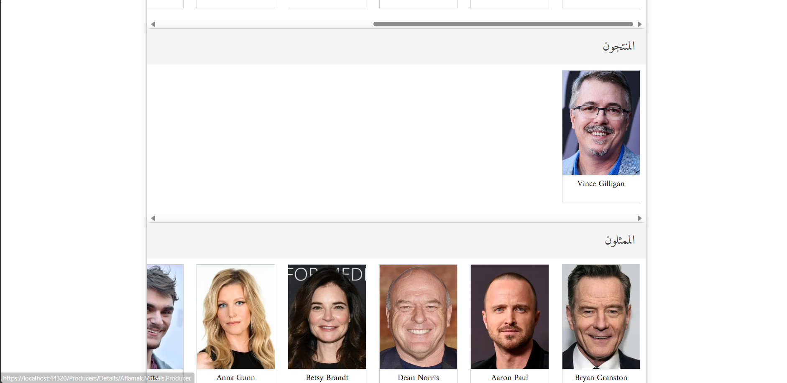
    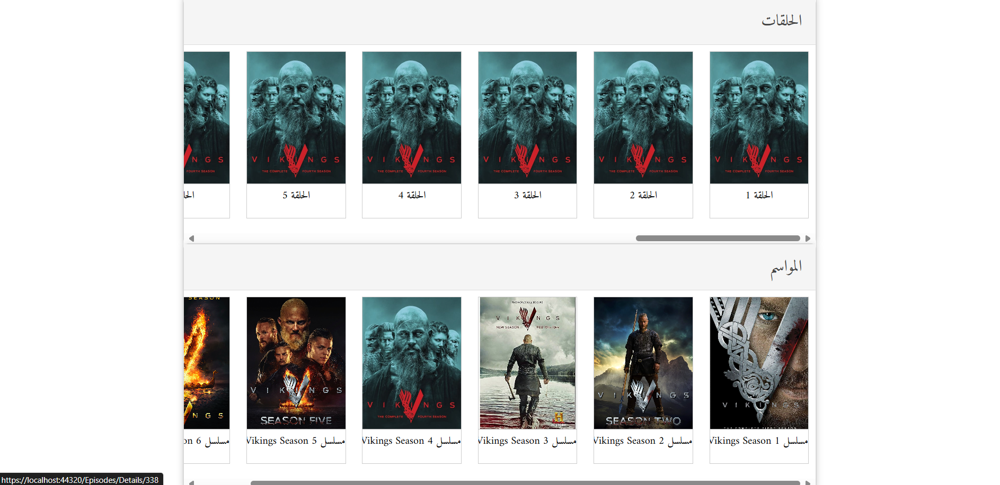
    
    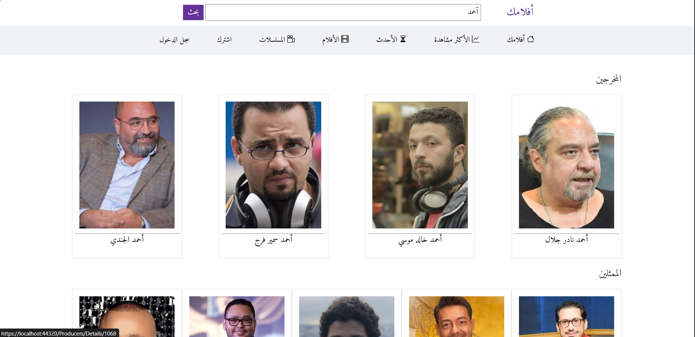
    

